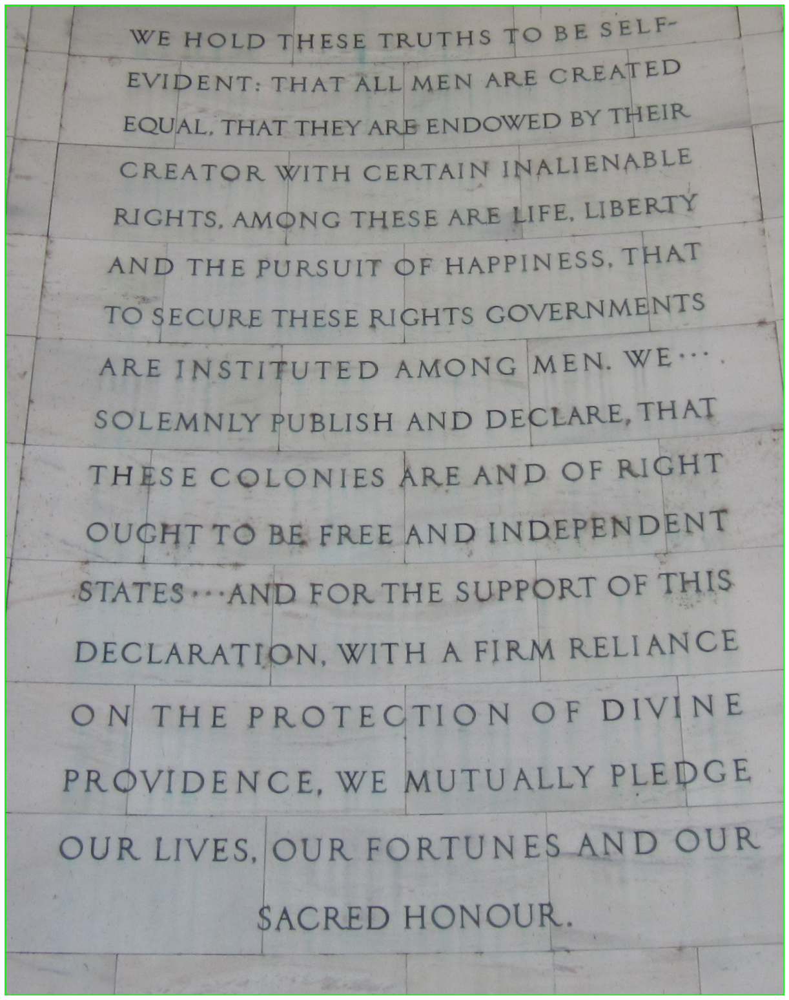
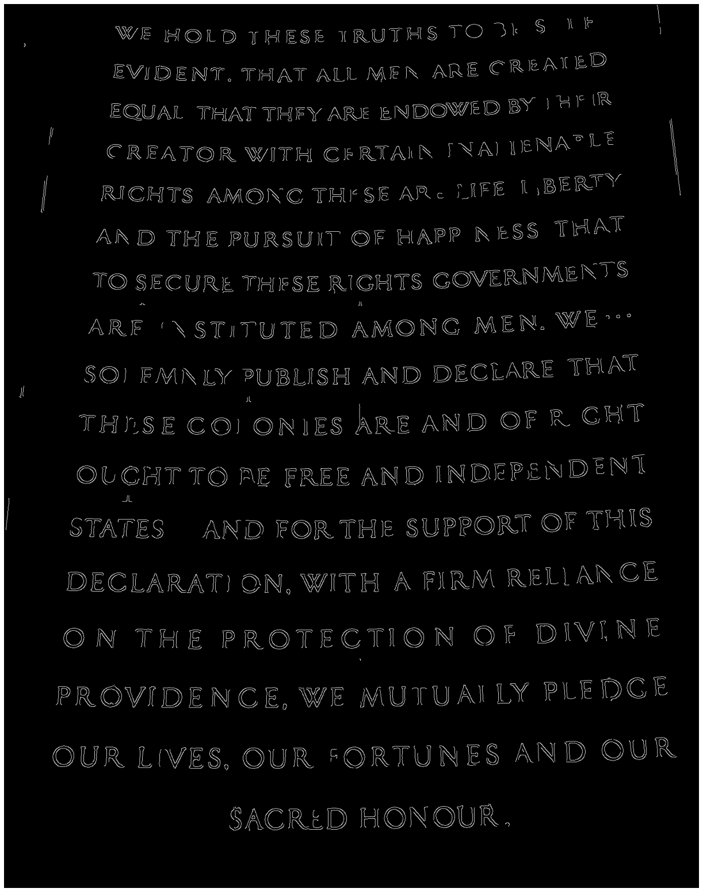
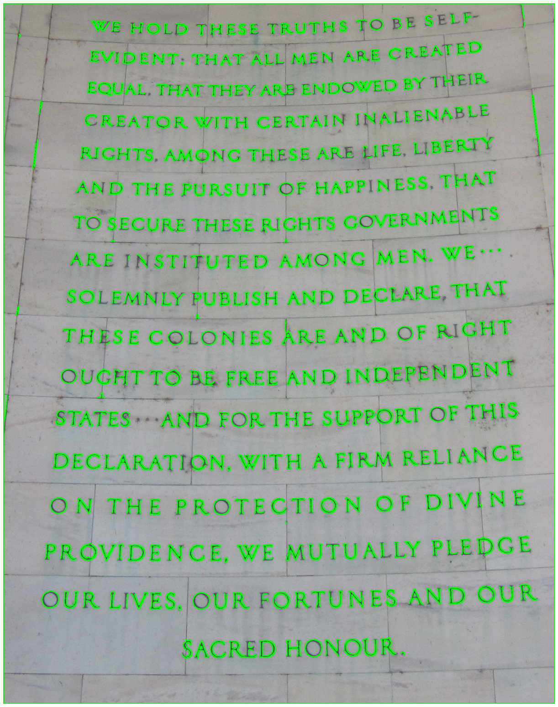

### Importing packages


```python
import os
from nbconvert import webpdf
import sys
sys.path.append(os.path.join(".."))
import cv2
import numpy as np
from utils.imutils import jimshow
from utils.imutils import jimshow_channel
import matplotlib.pyplot as plt
```

### Loading the image and checking the dimensions


```python
file_name = os.path.join("image.jpeg")
image = cv2.imread(file_name)
```


```python
image.shape #Check image shape

print(f"Image height: {image.shape[0]} pixels")
print(f"Image width: {image.shape[1]} pixels")
```

    Image height: 3240 pixels
    Image width: 4320 pixels


### Creating a green rectangle around the text

This was done by eyeballing the pixels and then adjusting it to fit manually


```python
cv2.rectangle(image, (1300,870), (2900,2900), (0,255,0), 3)
jimshow(image)
```


    

    


### Cropping the image
I use the same dimensions as I used for the rectangle


```python
cropped_image = image[870:2900, 1300:2900]

jimshow(cropped_image)
```


    

    


### Saving the image


```python
cv2.imwrite("image_cropped.jpg", cropped_image)
```


    True


# Edge Detection

- Loading image
- Making grey image, because I need a flat matrix for the manipulations
- Blurring the image as it eases edge detection
- Creating the canny edges, with manually adjusted thresholds


```python
file_name = os.path.join("image_cropped.jpg")
cropped_image = cv2.imread(file_name)
```


```python
#Flatten image to gray
grey_image = cv2.cvtColor(cropped_image, cv2.COLOR_BGR2GRAY)
#Blurring image
blurred = cv2.GaussianBlur(grey_image, (7,7),0)
```


```python
#Creating the edges
canny = cv2.Canny(blurred, 100,150)
#Showing the result
jimshow_channel(canny)
```


    

    


# Making Contours 
 
- Finding the contours with findContours()
- Drawing the contours in the original image
- saving the result


```python
#Creating Contours
(contours, _) = cv2.findContours(canny.copy(),
                cv2.RETR_EXTERNAL,
                cv2.CHAIN_APPROX_SIMPLE)
```


```python
#Applying contours to original image
contoured_image = cv2.drawContours(cropped_image.copy(),
                        contours,
                        -1,
                        (0,255,0),
                        2)
```


```python
cv2.imwrite("image_letters.jpg", contoured_image)
```


    True


```python
jimshow(contoured_image)
```


    

    

